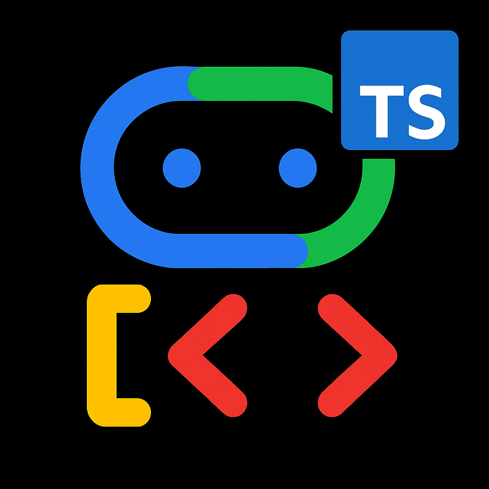

# Agent Development Kit (ADK) for TypeScript

[](LICENSE)
<!-- Placeholder for TS test badge: [](<URL_TO_YOUR_CI_WORKFLOW>) -->
[](https://www.reddit.com/r/agentdevelopmentkit/)

<html>
    <h2 align="center">
      
    </h2>
    <h3 align="center">
      An open-source, code-first TypeScript toolkit for building, evaluating, and deploying sophisticated AI agents with flexibility and control.
    </h3>
    <h3 align="center">
      Important Links:
      <a href="https://google.github.io/adk-docs/">Docs</a> (Note: Primarily Python-focused currently) &
      <a href="https://github.com/google/adk-samples">Samples</a> (Note: Primarily Python).
    </h3>
</html>

**⚠️ Work in Progress Notice:** This project is a **TypeScript port** of the original [Google ADK Python library](https://github.com/google/adk-python). It aims to provide similar functionality within the Node.js/TypeScript ecosystem but is currently under active development and should be considered **experimental (alpha)**. Features, APIs, and stability may differ from the Python version, and some components might be incomplete or subject to change.

Agent Development Kit (ADK) for TypeScript is a flexible and modular framework for developing and deploying AI agents. While optimized for Gemini and the Google ecosystem, ADK is model-agnostic, deployment-agnostic, and is built for compatibility with other frameworks. ADK was designed to make agent development feel more like software development, to make it easier for developers to create, deploy, and orchestrate agentic architectures that range from simple tasks to complex workflows.


---

## ✨ Key Features (TypeScript Port)

*(Based on the current codebase)*

-   **Rich Tool Ecosystem**: Utilize pre-built tools (`googleSearch`, `codeExecutionTool`), wrap custom functions easily (`FunctionTool`), integrate external APIs (`RestApiTool`, `APIHubToolset`, `MCPToolset`), or even use other agents as tools (`AgentTool`). Supports long-running operations (`LongRunningFunctionTool`).
-   **Code-First Development**: Define agent logic (`LlmAgent`), tools (`BaseTool`), flows (`AutoFlow`), and orchestration directly in TypeScript for flexibility, testability, and versioning within the Node.js ecosystem.
-   **Modular Multi-Agent Systems**: Design scalable applications by composing multiple specialized agents into flexible hierarchies using the `subAgents` property. `AutoFlow` enables automatic delegation.
-   **Integrated Developer Tooling**: Develop and iterate locally with ease using the included CLI (`adk-ts`) and Developer UI (`adk-ts web`) for running agents, inspecting execution (`Event` stream), debugging, and visualizing agent graphs (`adk-ts graph`).
-   **Native Streaming Support**: Build real-time, interactive experiences with native support for bidirectional streaming (text, potentially audio/video) using `Runner.runLive` and `LiveRequestQueue`.
-   **Built-in Agent Evaluation**: Assess agent performance systematically with the `evaluation` module (`AgentEvaluator`). Create multi-turn evaluation datasets (`.test.json` files) and run evaluations locally via the CLI (`adk-ts eval`).
-   **Broad LLM Support**: Optimized for Google's Gemini models (via `LlmRegistry` and `Gemini`), with flexibility to integrate various LLMs through the `LiteLlm` wrapper or by implementing the `BaseLlm` interface.
-   **Artifact Management**: Enable agents to handle files and binary data using `BaseArtifactService` implementations (`InMemoryArtifactService`, `GcsArtifactService`) and `ToolContext` methods.
-   **Extensibility and Interoperability**: ADK TypeScript promotes an open ecosystem, allowing easy integration with tools from frameworks like LangChain (`LangchainTool`) and CrewAI (`CrewaiTool`).
-   **State and Memory Management**: Handles short-term conversational memory (`State` within a `Session`) managed by `SessionService` (`InMemorySessionService`, `DatabaseSessionService`). Provides integration points for longer-term `Memory` (`BaseMemoryService`).

## 🚀 Installation

### Using the CLI Globally (Recommended)

For most users, installing the ADK TypeScript CLI globally is the recommended approach. This allows you to create and manage agents from anywhere on your system:

```bash
npm install -g adk-typescript
# or
# yarn global add adk-typescript
```

After global installation, you can use commands like `adk-ts create my-new-agent` to create new agent projects. When you create an agent with the CLI, the necessary dependencies (including the ADK library itself) are automatically added to the agent project's `package.json`.

> **Note:** This differs from the Python ADK installation pattern because TypeScript/Node.js has a clearer separation between global CLI tools and local project dependencies. The global installation here is only for the CLI tool that helps you create and manage agents.

### Installing as a Library (For Advanced Use Cases)

If you're building a custom agent without using the CLI or integrating ADK into an existing application, you can install it as a library:

1.  **Navigate to your project directory.**
2.  **Initialize npm (if not already done):** `npm init -y`
3.  **Install locally:**
    ```bash
    npm install adk-typescript
    # or
    # yarn add adk-typescript
    ```
4.  **Install supporting packages:**
    ```bash
    npm install dotenv @types/dotenv typescript @types/node --save-dev
    # or
    # yarn add dotenv @types/dotenv typescript @types/node --dev
    ```

See the [Installation Guide](./installation.md) for more details on setting up your environment.

## 📚 Documentation

Explore the full documentation for detailed guides. *Please note that the official documentation currently focuses on the Python version, but many core concepts are similar.*

*   **[Official ADK Documentation](https://google.github.io/adk-docs)** (Primarily Python)
*   Refer to the `*.md` files within *this* repository (like `quickstart.md`, `tutorial.md`) for TypeScript-specific guidance based on this port.

### Generating API Reference Documentation

This project uses TypeDoc to automatically generate API reference documentation from TypeScript source code and JSDoc comments.

#### For Local Development

To generate and view the documentation locally:

```bash
# Install dependencies if you haven't already
npm install

# Generate the API reference
npm run docs
```

This will create HTML documentation in the `docs/api-reference` directory, which you can view in your browser by opening `docs/api-reference/index.html`.

#### For Published Documentation

The API reference documentation is automatically generated during the CI/CD process when changes are pushed to the main branch. The workflow:

1. Runs TypeDoc to generate fresh API documentation
2. Builds the full documentation site with MkDocs
3. Publishes the complete documentation to GitHub Pages

You don't need to commit the generated files as they're created during the build process.

## ⚙️ Using the CLI (`adk-ts`)

The ADK TypeScript CLI provides commands to manage and run your agents. *(Ensure you have built the project (`npm run build`) or installed it globally)*.

**1. Create a New Agent Project:**

Generates a starter agent template with necessary files (`agent.ts`, `package.json`, `tsconfig.json`, `.env`).

```bash
adk-ts create <your-agent-name>
# Example: adk-ts create my_weather_agent
```
Follow the interactive prompts to configure the model and backend.

**2. Run an Agent Interactively (Terminal):**

Starts a command-line chat interface to interact with your agent.

```bash
# Navigate to the parent directory of your agent folder
adk-ts run <your_agent_folder_name>
# Example: adk-ts run my_weather_agent

# Or navigate into the agent folder and run:
cd my_weather_agent
adk-ts run .
```

**3. Run the Development Web UI:**

Starts a local web server with a chat UI for testing and inspecting agent behavior.

```bash
# Navigate to the parent directory of your agent folder(s)
adk-ts web <your_agent_folder_name>
# Example: adk-ts web my_weather_agent

# Or run from inside the agent folder:
cd my_weather_agent
adk-ts web .
```
Access the UI in your browser (usually `http://localhost:3000`).

**4. Run the API Server:**

Starts a local Express.js server exposing REST endpoints to interact with your agent(s) programmatically. Useful for integration testing.

```bash
# Navigate to the parent directory of your agent folder(s)
adk-ts api_server --agent_dir <your_agent_folder_name_or_parent_dir>
# Example (serving one agent): adk-ts api_server --agent_dir my_weather_agent
# Example (serving all agents in current dir): adk-ts api_server --agent_dir .
```

**5. Evaluate an Agent:**

Runs evaluations based on predefined datasets (`.test.json` files).

```bash
adk-ts eval <path_to_agent_folder> <path_to_eval_set.test.json>
# Example:
# adk-ts eval ./my_weather_agent ./my_weather_agent/eval_data.test.json
```

**6. Generate Agent Graph:**

Creates a visual representation of your agent and its tools/sub-agents (requires Graphviz installed).

```bash
adk-ts graph <path_to_agent_folder> --output graph.png
# Example: adk-ts graph ./my_weather_agent --output weather_agent_graph.png
```

**7. Deploy to Cloud Run:**

Packages and deploys your agent to Google Cloud Run. 

```bash
adk-ts deploy cloud_run <path_to_agent_folder> --project <your-gcp-project> --region <gcp-region> --service_name <your-service-name>
```

## 🤝 Contributing

We welcome contributions from the community! As this is a work-in-progress port, contributions are especially valuable. Whether it's bug reports, feature requests, documentation improvements, or code contributions, please see our [**Contributing Guidelines**](./CONTRIBUTING.md) (Link may need updating for TypeScript specifics) to get started.

## 📄 License

This project is licensed under the Apache 2.0 License - see the [LICENSE](LICENSE) file for details.

## Preview

This software (ADK TypeScript Port) is currently **experimental (alpha)** and not an officially supported Google product. It is subject to the "Pre-GA Offerings Terms" in the General Service Terms section of the [Service Specific Terms](https://cloud.google.com/terms/service-terms#1). Pre-GA features are available "as is" and might have limited support. For more information, see the [launch stage descriptions](https://cloud.google.com/products?hl=en#product-launch-stages).

---

*Happy Agent Building with TypeScript!*