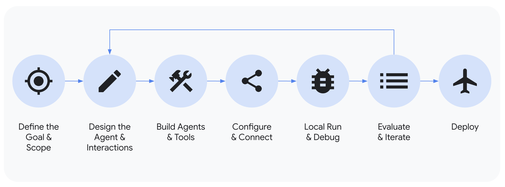

# Agent Development Kit (ADK) for TypeScript

 <b> Build, Evaluate and Deploy agents, seamlessly! </b> 

ADK for TypeScript is designed to empower developers to build, manage, evaluate, and deploy AI-powered agents using TypeScript. It provides a robust and flexible environment for creating both conversational and non-conversational agents, capable of handling complex tasks and workflows.

 

## Core Concepts

ADK TypeScript is built around a few key primitives and concepts that make it powerful and flexible. Here are the essentials:

*   **Agent (`BaseAgent`, `LlmAgent`):** The fundamental worker unit designed for specific tasks. Agents can use language models (`LlmAgent`) for complex reasoning or act as deterministic controllers of execution using workflow agents like `SequentialAgent`, `ParallelAgent`, or `LoopAgent`.
*   **Tool (`BaseTool`, `FunctionTool`, `AgentTool`, etc.):** Gives agents abilities beyond conversation, letting them interact with external APIs (`RestApiTool`), search information (`GoogleSearchTool`, Retrieval tools), run code (`CodeExecutionTool`), or call other agents (`AgentTool`). Custom functions are easily wrapped using `FunctionTool`.
*   **Callbacks (`beforeModelCallback`, `afterModelCallback`, etc.):** Custom TypeScript functions you provide to run at specific points in the agent's process (like before/after LLM calls or tool execution), allowing for checks, logging, or behavior modifications.
*   **Session Management (`Session`, `State`, `SessionService`):** Handles the context of a single conversation (`Session`), including its history (`events`) and the agent's working memory for that conversation (`State`). `SessionService` (e.g., `InMemorySessionService`, `DatabaseSessionService`) manages session persistence.
*   **Memory (`BaseMemoryService`):** Enables agents to recall information about a user across *multiple* sessions, providing long-term context (distinct from short-term session `State`). Implementations like `InMemoryMemoryService` and `VertexAiRagMemoryService` are provided.
*   **Artifact Management (`BaseArtifactService`):** Allows agents to save, load, and manage files or binary data (like images, PDFs represented as `Part` with `inlineData`) associated with a session or user. Implementations like `InMemoryArtifactService` and `GcsArtifactService` exist.
*   **Code Execution (`BaseCodeExecutor`):** The ability for agents (usually via Tools like `CodeExecutionTool` or the built-in model capability via `BuiltInCodeExecutionTool`) to generate and execute code.
*   **Planning (`BasePlanner`, `PlanReActPlanner`):** An advanced capability where agents can break down complex goals into smaller steps and plan how to achieve them, like using a ReAct planner.
*   **Models (`BaseLlm`, `LlmRegistry`, `LiteLlm`):** The underlying LLM that powers `LlmAgent`s. `LlmRegistry` manages built-in support (like `Gemini`, `Claude`), while `LiteLlm` provides a wrapper for broader compatibility via the LiteLLM standard.
*   **Event (`Event`):** The basic unit of communication representing things that happen during a session (user message, agent reply, tool use), forming the conversation history stored in `Session.events`. Contains `Content`.
*   **Content & Part (`Content`, `Part`):** Structures defining messages. `Content` has a `role` (user, model, etc.) and an array of `Part`s. A `Part` can contain `text`, `functionCall`, `functionResponse`, or `inlineData`.
*   **Runner (`Runner`, `InMemoryRunner`):** The engine that manages the execution flow, orchestrates agent interactions based on `Events`, and coordinates with backend services like `SessionService` and `ArtifactService`. `InMemoryRunner` bundles the agent with in-memory services for easy local testing.
*   **Flow (`BaseLlmFlow`, `AutoFlow`, `SingleFlow`):** Defines the control logic within an `LlmAgent`, managing the sequence of LLM calls, tool executions, and processing steps. `AutoFlow` provides default behavior including delegation.

***Note:** Features like Multimodal Streaming, Evaluation, Deployment, Debugging, and Trace are also part of the broader ADK TypeScript ecosystem, supporting real-time interaction and the development lifecycle.*

## Key Capabilities

ADK TypeScript offers several key advantages for developers building agentic applications:

1.  **Multi-Agent System Design:** Easily build applications composed of multiple, specialized agents (`BaseAgent`, `LlmAgent`) arranged hierarchically using `subAgents`. Agents can coordinate complex tasks, delegate using LLM-driven transfer (via `AutoFlow`) or explicit `AgentTool` invocation, enabling modular and scalable solutions.
2.  **Rich Tool Ecosystem:** Equip agents with diverse capabilities. ADK TypeScript supports integrating custom functions (`FunctionTool`), using other agents as tools (`AgentTool`), leveraging built-in functionalities like code execution (`CodeExecutionTool`, `BuiltInCodeExecutionTool`), and interacting with external data sources and APIs (e.g., `GoogleSearchTool`, `VertexAISearchTool`, `RestApiTool`, `APIHubToolset`). Support for long-running tools (`LongRunningFunctionTool`) allows handling asynchronous operations effectively.
3.  **Flexible Orchestration:** Define complex agent workflows using built-in workflow agents (`SequentialAgent`, `ParallelAgent`, `LoopAgent`) alongside LLM-driven dynamic routing via `AutoFlow`. This allows for both predictable pipelines and adaptive agent behavior.
4.  **Integrated Developer Tooling:** Develop and iterate locally with ease. ADK TypeScript includes tools like a command-line interface (`adk-ts`) and a Developer UI (`adk-ts web`) for running agents, inspecting execution steps (`Event` logs, state changes), debugging interactions, and visualizing agent definitions (`adk-ts graph`).
5.  **Native Streaming Support:** Build real-time, interactive experiences with native support for bidirectional streaming (text and potentially audio/video) using `Runner.runLive`, `LiveRequestQueue`, and compatible models/connections (`GeminiLlmConnection`).
6.  **Built-in Agent Evaluation:** Assess agent performance systematically using the `evaluation` module (`AgentEvaluator`, `ResponseEvaluator`, `TrajectoryEvaluator`). Create multi-turn evaluation datasets (`.test.json` files) and run evaluations locally (via CLI or potentially the dev UI) to measure quality and guide improvements.
7.  **Broad LLM Support:** While optimized for Google's Gemini models (via `LlmRegistry` and `Gemini`), the framework is designed for flexibility. Integrate various LLMs using the `LiteLlm` wrapper or by implementing the `BaseLlm` interface for custom models.
8.  **Artifact Management:** Enable agents to handle files and binary data. The framework provides mechanisms (`BaseArtifactService`, `InMemoryArtifactService`, `GcsArtifactService`) and context methods (`ToolContext.saveArtifact`, `ToolContext.loadArtifact`) for managing versioned artifacts.
9.  **Extensibility and Interoperability:** ADK TypeScript promotes an open ecosystem. Easily integrate and reuse tools from other popular agent frameworks like LangChain (`LangchainTool`) and CrewAI (`CrewaiTool`).
10. **State and Memory Management:** Automatically handles short-term conversational memory (`State` within a `Session`) managed by the `SessionService`. Provides integration points for longer-term `Memory` services (`BaseMemoryService`) for cross-session recall. `ToolContext` provides access to state within tools.

 

## Get Started

*   Ready to build your first agent? [Try the quickstart](./quickstart.md)