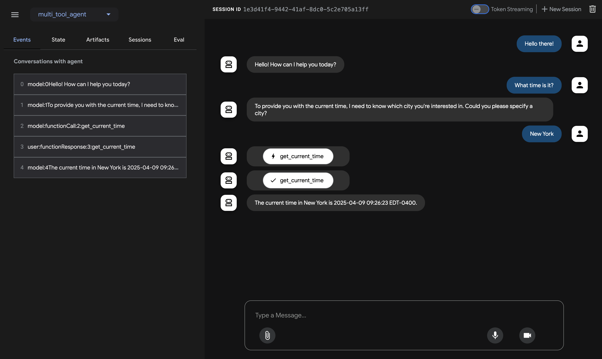

# Quickstart (ADK TypeScript)

This quickstart guides you through installing the Agent Development Kit (ADK) for TypeScript, setting up a basic agent with multiple tools, and running it locally either in the terminal or in the interactive, browser-based dev UI.

This quickstart assumes a local development environment (VS Code, WebStorm, etc.) with Node.js (v18+ recommended), npm/yarn, and terminal access. This method runs the application entirely on your machine and is recommended for development and testing.

## 1. Set up Environment & Install ADK TypeScript {#venv-install-typescript}

**Environment Setup:**

*   Ensure you have Node.js (v18+) and npm (or yarn) installed.
*   Navigate to the directory where you want to create your project.

**Create Project & Install ADK TypeScript:**

```bash
# Create a new project directory and navigate into it
mkdir my-adk-project
cd my-adk-project

# Initialize npm project (creates package.json)
npm init -y

# Install ADK TypeScript (replace with actual package name if different)
npm install adk-typescript

# Install dotenv for environment variable handling
npm install dotenv @types/dotenv
```

## 2. Create Agent Project {#create-agent-project-typescript}

### Project structure

You will need to create the following project structure:

```console
my-adk-project/               # Your parent project folder
├── multi_tool_agent/         # Your agent's code folder
│   └── agent.ts              # Agent definition lives here
├── .env                      # API keys and configuration
├── package.json              # Node.js project manifest
├── tsconfig.json             # TypeScript configuration
└── dist/                     # (Created after build) Compiled JavaScript output
```

Create the agent folder inside your project:

```bash
# Make sure you are in the my-adk-project directory
mkdir multi_tool_agent
```

### TypeScript Configuration

Create the `tsconfig.json` file in your project root (`my-adk-project/`):

```bash
# Create TypeScript configuration file (using your preferred text editor)
touch tsconfig.json
```

Copy and paste the following content into your `tsconfig.json` file:

```json
{
  "compilerOptions": {
    "target": "ES2020",
    "module": "Node16",      // Required for proper module resolution
    "outDir": "./dist",
    "rootDir": "./",         // Assumes agent.ts is directly in multi_tool_agent
    "strict": true,
    "esModuleInterop": true,
    "skipLibCheck": true,
    "forceConsistentCasingInFileNames": true,
    "moduleResolution": "node16", // Required for subpath imports
    "resolveJsonModule": true,
    "declaration": true      // Optional: generates .d.ts files
  },
  "include": ["multi_tool_agent/**/*.ts"], // Include files in your agent folder
  "exclude": ["node_modules", "dist"]
}
```

Add a build script to your `package.json`:

```bash
# Update package.json with build scripts using npm pkg commands
npm pkg set main="dist/multi_tool_agent/agent.js"
npm pkg set scripts.build="tsc"
npm pkg set scripts.start="node dist/multi_tool_agent/agent.js"
```

### `agent.ts`

Create an `agent.ts` file inside the `multi_tool_agent/` folder:

```bash
# Create agent.ts file (using your preferred text editor)
touch multi_tool_agent/agent.ts
```

Copy and paste the following code into `multi_tool_agent/agent.ts`:

```typescript
import { LlmAgent as Agent } from 'adk-typescript/agents';
import { LlmRegistry } from 'adk-typescript/models';
import { FunctionTool, ToolContext } from 'adk-typescript/tools';

// --- Tool Functions ---

/**
 * Returns current weather information for a specified city
 * @param params Object containing city name
 * @param context Optional ToolContext
 * @returns Promise resolving to weather information or error
 */
async function getWeather(
  params: { city: string },
  context?: ToolContext
): Promise<{ status: string; report?: string; error_message?: string }> {
  const city = params.city;
  console.log(`--- Tool: getWeather called for city: ${city} ---`);
  const cityNormalized = city.toLowerCase().trim();
  const mockWeatherDb: Record<string, { status: string; report: string }> = {
    "newyork": {status: "success", report: "The weather in New York is sunny with a temperature of 25°C."},
    "london": {status: "success", report: "It's cloudy in London with a temperature of 15°C."},
    "tokyo": {status: "success", report: "Tokyo is experiencing light rain and a temperature of 18°C."},
  };
  if (mockWeatherDb[cityNormalized]) { return mockWeatherDb[cityNormalized]; }
  else { return {status: "error", error_message: `Sorry, I don't have weather information for '${city}'.`}; }
}

/**
 * Gets the current local time and timezone.
 * @param params Empty object (no parameters needed)
 * @param context Optional ToolContext
 * @returns Promise resolving to time information
 */
async function getCurrentTime(
  params: {}, // No parameters expected
  context?: ToolContext
): Promise<{ currentTime: string; timezone: string; }> {
    console.log(`--- Tool: getCurrentTime called ---`);
    const now = new Date();
    return {
        currentTime: now.toLocaleTimeString(),
        timezone: Intl.DateTimeFormat().resolvedOptions().timeZone
    };
}

// --- Tool Wrappers ---

const getWeatherTool = new FunctionTool({
  name: "getWeather",
  description: "Returns current weather information for a specified city",
  fn: getWeather,
  functionDeclaration: {
    name: "getWeather",
    description: "Returns current weather information for a specified city",
    parameters: {
      type: 'object',
      properties: {
        city: { type: 'string', description: 'The name of the city (e.g., "New York")'}
      },
      required: ['city']
    }
  }
});

const getCurrentTimeTool = new FunctionTool({
    name: "getCurrentTime",
    description: "Gets the current local time and timezone.",
    fn: getCurrentTime,
    functionDeclaration: {
        name: "getCurrentTime",
        description: "Gets the current local time and timezone.",
        parameters: { type: 'object', properties: {} } // No parameters
    }
});


// --- Agent Definition ---

// Use LlmRegistry to get a model instance
const agentLlm = LlmRegistry.newLlm("gemini-1.5-flash"); // Or another compatible model

// Export the root agent for ADK tools to find
export const rootAgent = new Agent({
  name: "weather_time_agent", // Unique agent name
  model: agentLlm,             // LLM instance
  description: "Provides current weather and time information for cities.",
  instruction: "You are a helpful assistant. Use the 'getWeather' tool for weather queries " +
               "and the 'getCurrentTime' tool for time queries. Provide clear answers based on tool results. " +
               "If asked for weather AND time, use both tools.",
  tools: [getWeatherTool, getCurrentTimeTool], // List of available tools
});

// Optional: Default export if needed by other parts of your application
// export default { rootAgent };
```

### `.env`

Create a `.env` file in your project root (`my-adk-project/`):

```bash
touch .env
```

Add your API key and platform configuration to this file. More instructions are in the next section.


## 3. Set up the model {#set-up-the-model-typescript}

Your agent needs credentials to securely call the LLM service.

=== "Gemini - Google AI Studio"

    1.  Get an API key from [Google AI Studio](https://aistudio.google.com/apikey).
    2.  Open the **`.env`** file in your project root and add the following content:

        ```env title=".env"
        # Use Google AI backend (value 0 or false)
        GOOGLE_GENAI_USE_VERTEXAI=0
        # Your API Key
        GOOGLE_API_KEY=PASTE_YOUR_ACTUAL_API_KEY_HERE
        ```

    3.  Edit the `.env` file to replace `PASTE_YOUR_ACTUAL_API_KEY_HERE` with your actual API key.

=== "Gemini - Google Cloud Vertex AI"

    1.  You need an existing [Google Cloud](https://cloud.google.com/?e=48754805&hl=en) account and project.
        *   Set up a [Google Cloud project](https://cloud.google.com/vertex-ai/generative-ai/docs/start/quickstarts/quickstart-multimodal#setup-gcp).
        *   Set up the [gcloud CLI](https://cloud.google.com/vertex-ai/generative-ai/docs/start/quickstarts/quickstart-multimodal#setup-local).
        *   Authenticate to Google Cloud for Application Default Credentials (ADC): `gcloud auth application-default login`.
        *   [Enable the Vertex AI API](https://console.cloud.google.com/flows/enableapi?apiid=aiplatform.googleapis.com).
    2.  Open the **`.env`** file in your project root and add the following content:

        ```env title=".env"
        # Use Vertex AI backend (value 1 or true)
        GOOGLE_GENAI_USE_VERTEXAI=1
        # Your Project ID
        GOOGLE_CLOUD_PROJECT=YOUR_PROJECT_ID
        # Your Project Location (e.g., us-central1)
        GOOGLE_CLOUD_LOCATION=us-central1
        # GOOGLE_API_KEY is NOT needed when using Vertex AI with ADC
        ```

    3.  Edit the `.env` file to replace `YOUR_PROJECT_ID` with your actual Google Cloud project ID and update the location if needed.

## 4. Run Your Agent {#run-your-agent-typescript}

First, **build** your TypeScript code:

```bash
# Make sure you are in your project root (my-adk-project/)
npm run build
```

Now you can interact with your agent using the ADK TypeScript CLI tools. Make sure you run these commands from your project root directory (`my-adk-project/`).


=== "Dev UI (adk-ts web)"

    Run the following command to launch the **dev UI**:

    ```bash
    adk-ts web multi_tool_agent
    ```

    **Step 1:** Open the URL provided (usually `http://localhost:3000`) directly in your browser.

    **Step 2.** In the top-left corner of the UI, select your agent: "multi_tool_agent".

    !!!note "Troubleshooting"

        If you do not see "multi_tool_agent" in the dropdown menu, ensure you ran `adk-ts web` from the **correct directory** (`my-adk-project/` in this example) where your agent folder is located.

    **Step 3.** Chat with your agent using the textbox:

    

    **Step 4.** Inspect individual function calls, responses, and model interactions by clicking on the interaction steps:

    

    **Step 5.** (Optional) Try voice interaction if the UI supports it and your model/setup allows:

    !!!note "Model support for voice/video streaming"

        Using voice/video streaming requires Gemini models that support the necessary APIs (see [Streaming Quickstart](./quickstart-streaming.md) and model documentation). You would also need to adjust the agent configuration and potentially the UI.

    

=== "Terminal (adk-ts run)"

    Run the following command to chat with your agent directly in the terminal:

    ```bash
    adk-ts run multi_tool_agent
    ```

    

    Type your prompts and press Enter. To exit, use Cmd/Ctrl+C.

=== "API Server (adk-ts api_server)"

    `adk-ts api_server` starts a local Express.js server, allowing you to test API requests before deployment. Specify the directory containing *all* your agent folders (if you have multiple) or the specific agent folder.

    ```bash
    # If multi_tool_agent is the only agent in the current dir
    adk-ts api_server --agent_dir .

    # Or specify the agent folder directly
    adk-ts api_server --agent_dir multi_tool_agent
    ```

    

    To learn how to use `adk-ts api_server` for testing, refer to the [documentation on testing](./testing.md).

### 📝 Example prompts to try

*   What is the weather in New York?
*   What is the time in New York?
*   What is the weather in Paris?
*   What is the time in Paris?
*   What time is it in London and what's the weather like?

## 🎉 Congratulations!

You've successfully created and interacted with your first agent using ADK TypeScript!

---

## 🛣️ Next steps

*   **Go to the tutorial**: Learn how to build a multi-agent system, add memory, session state, and safety guardrails: [tutorial](./tutorial.md).
*   **Delve into advanced configuration:** Explore the [setup](./installation.md) section for deeper dives into project structure and configuration.
*   **Understand Core Concepts:** Learn about [ADK TypeScript Concepts](../agents/index.md) (Link needs update for TS).