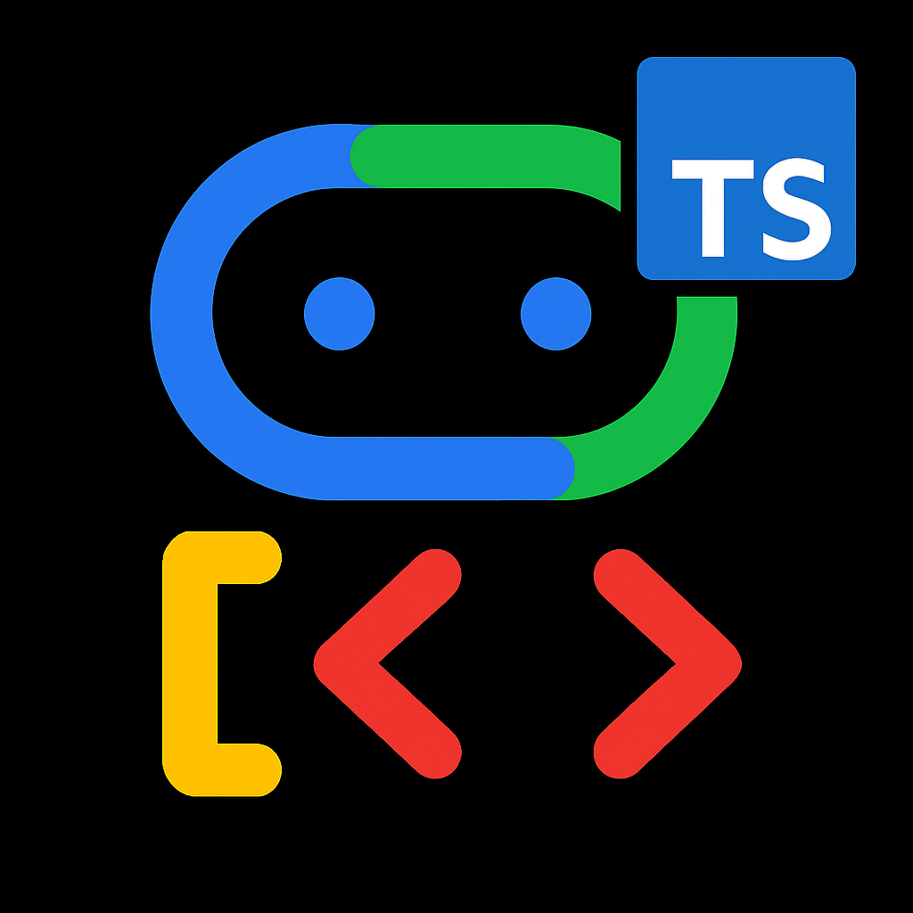

---
hide:
  - toc
---

  

    
    <h1>Agent Development Kit (ADK) for TypeScript</h1>
  

  <b>An open-source AI agent framework integrated with Gemini and Google, built for TypeScript/Node.js</b> 

  ⚠️ This is a Work-in-Progress TypeScript port of the original Python ADK. Features and stability may vary.

## What is ADK TypeScript?

Agent Development Kit (ADK) for TypeScript is a flexible and modular framework for **developing and deploying AI agents using TypeScript**. ADK can be used with popular LLMs like Google's Gemini and is designed with a focus on **tight integration with the Google ecosystem**. ADK TypeScript makes it **easy to get started with simple agents** powered by Gemini models and Google tools, while providing the control and structure needed for **more complex agent architectures and orchestration** within the Node.js environment.

  

    Get started:
     
    <code>npm install adk-typescript</code>
     
    (Or install globally: <code>npm install -g adk-typescript</code> for CLI)
  

  <a href="get-started/quickstart/" class="md-button">Quickstart</a>
  <a href="get-started/tutorial/" class="md-button">Tutorial</a>
  <a href="http://github.com/google/adk-samples" class="md-button" target="_blank">Sample Agents (Python)</a>
  <!-- <a href="api-reference/" class="md-button">API Reference</a> -->
  <a href="contributing-guide/" class="md-button">Contribute ❤️</a>

---

## Learn more

- { .lg .middle } **Flexible Orchestration**

    ---

    Define workflows using workflow agents (`SequentialAgent`, `ParallelAgent`, `LoopAgent`) for predictable pipelines, or leverage LLM-driven dynamic routing (`LlmAgent` with `AutoFlow`) for adaptive behavior.

    [:octicons-arrow-right-24: Learn about agents](agents/index.md)

- { .lg .middle } **Multi-Agent Architecture**

    ---

    Build modular and scalable applications by composing multiple specialized agents (`LlmAgent`, `BaseAgent`) in a hierarchy using `subAgents`. Enable complex coordination and delegation.

    [:octicons-arrow-right-24: Explore multi-agent systems](agents/multi-agents.md)

- { .lg .middle } **Rich Tool Ecosystem**

    ---

    Equip agents with diverse capabilities: use pre-built tools (`googleSearch`, `codeExecutionTool`), create custom functions (`FunctionTool`), integrate 3rd-party libraries (LangChain via `LangchainTool`, CrewAI via `CrewaiTool`), or use other agents as tools (`AgentTool`).

    [:octicons-arrow-right-24: Browse tools](tools/index.md)

- { .lg .middle } **Deployment Ready**

    ---

    Containerize and deploy your TypeScript agents anywhere – run locally, scale with Vertex AI Agent Engine (check compatibility), or integrate into custom infrastructure using Cloud Run or Docker.

    [:octicons-arrow-right-24: Deploy agents](deploy/index.md)

- { .lg .middle } **Built-in Evaluation**

    ---

    Systematically assess agent performance using the `evaluation` module (`AgentEvaluator`) by evaluating both final responses and execution trajectories against test datasets (`.test.json`).

    [:octicons-arrow-right-24: Evaluate agents](evaluate/index.md)

- { .lg .middle } **Building Responsible Agents**

    ---

    Learn how to build powerful and trustworthy agents by implementing responsible AI patterns using features like Callbacks (`beforeModelCallback`, `beforeToolCallback`).

    [:octicons-arrow-right-24: Responsible agents](safety/index.md)

!!! Preview

    This feature is subject to the "Pre-GA Offerings Terms" in the General
    Service Terms section of the
    [Service Specific Terms](https://cloud.google.com/terms/service-terms#1).
    Pre-GA features are available "as is" and might have limited support. For
    more information, see the
    [launch stage descriptions](https://cloud.google.com/products#product-launch-stages).

