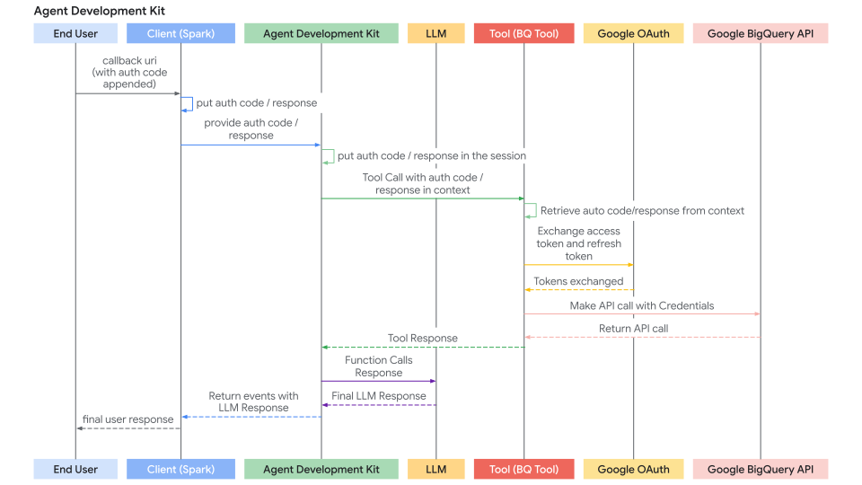

# Authenticating with Tools

## Core Concepts

Many tools need to access protected resources (like user data in Google Calendar, Salesforce records, etc.) and require authentication. ADK provides a system to handle various authentication methods securely.

The key components involved are:

1. **`AuthScheme`**: Defines *how* an API expects authentication credentials (e.g., as an API Key in a header, an OAuth 2.0 Bearer token). ADK supports the same types of authentication schemes as OpenAPI 3.0. To know more about what each type of credential is, refer to [OpenAPI doc: Authentication](https://swagger.io/docs/specification/v3_0/authentication/). ADK uses classes like `ApiKeyAuthScheme`, `BearerAuthScheme`, and interfaces like `OpenIdConnectWithConfig`.  
2. **`AuthCredential`**: Holds the *initial* information needed to *start* the authentication process (e.g., your application's OAuth Client ID/Secret, an API key value). It includes an `authType` property (like `API_KEY`, `OAUTH2`, `SERVICE_ACCOUNT`) specifying the credential type.

The general flow involves providing these details when configuring a tool. ADK then attempts to automatically exchange the initial credential for a usable one (like an access token) before the tool makes an API call. For flows requiring user interaction (like OAuth consent), a specific interactive process involving the Agent Client application is triggered.

## Supported Initial Credential Types

* **API_KEY:** For simple key/value authentication. Usually requires no exchange.  
* **HTTP:** Can represent Basic Auth (not recommended/supported for exchange) or already obtained Bearer tokens. If it's a Bearer token, no exchange is needed.  
* **OAUTH2:** For standard OAuth 2.0 flows. Requires configuration (client ID, secret, scopes) and often triggers the interactive flow for user consent.  
* **OPEN_ID_CONNECT:** For authentication based on OpenID Connect. Similar to OAuth2, often requires configuration and user interaction.  
* **SERVICE_ACCOUNT:** For Google Cloud Service Account credentials (JSON key or Application Default Credentials). Typically exchanged for a Bearer token.

## Configuring Authentication on Tools

You set up authentication when defining your tool:

* **RestApiTool / OpenAPIToolset**: Pass `authScheme` and `authCredential` during initialization

* **GoogleApiToolSet Tools**: ADK has built-in 1st party tools like Google Calendar, BigQuery etc. Use the toolset's specific configuration method.

* **APIHubToolset / ApplicationIntegrationToolset**: Pass `authScheme` and `authCredential` during initialization, if the API managed in API Hub / provided by Application Integration requires authentication.

!!! tip "WARNING" 
    Storing sensitive credentials like access tokens and especially refresh tokens directly in the session state might pose security risks depending on your session storage backend (`SessionService`) and overall application security posture.

    *   **`InMemorySessionService`:** Suitable for testing and development, but data is lost when the process ends. Less risk as it's transient.
    *   **Database/Persistent Storage:** **Strongly consider encrypting** the token data before storing it in the database using a robust encryption library and managing encryption keys securely (e.g., using a key management service).
    *   **Secure Secret Stores:** For production environments, storing sensitive credentials in a dedicated secret manager (like Google Cloud Secret Manager or HashiCorp Vault) is the **most recommended approach**. Your tool could potentially store only short-lived access tokens or secure references (not the refresh token itself) in the session state, fetching the necessary secrets from the secure store when needed.

---

## Journey 1: Building Agentic Applications with Authenticated Tools

This section focuses on using pre-existing tools (like those from `RestApiTool/ OpenAPIToolset`, `APIHubToolset`, `GoogleApiToolSet`) that require authentication within your agentic application. Your main responsibility is configuring the tools and handling the client-side part of interactive authentication flows (if required by the tool).

### 1. Configuring Tools with Authentication

When adding an authenticated tool to your agent, you need to provide its required `AuthScheme` and your application's initial `AuthCredential`.

**A. Using OpenAPI-based Toolsets (`OpenAPIToolset`, `APIHubToolset`, etc.)**

Pass the scheme and credential during toolset initialization. The toolset applies them to all generated tools. Here are few ways to create tools with authentication in ADK.

=== "API Key"

      Create a tool requiring an API Key.

      ```typescript
      import { APIHubToolset } from 'adk-typescript';
      
      // Creating an API Key auth scheme
      const authScheme = {
        type: 'apiKey',
        name: 'apikey',
        in: 'query'
      };
      
      // Creating the credential with the actual API key
      const authCredential = {
        authType: 'API_KEY',
        apiKey: {
          apiKey: 'YOUR_API_KEY_STRING'
        }
      };
      
      // Create the toolset with authentication
      const sampleApiToolset = new APIHubToolset({
        name: 'sample-api-requiring-api-key',
        description: 'A tool using an API protected by API Key',
        apihubResourceName: '...',
        authScheme: authScheme,
        authCredential: authCredential
      });
      ```

=== "OAuth2"

      Create a tool requiring OAuth2.

      ```typescript
      import { 
        OpenAPIToolset, 
        AuthCredential, 
        AuthCredentialTypes, 
        OAuth2Auth 
      } from 'adk-typescript';
      
      // Define the OAuth2 auth scheme with flow configuration
      const authScheme = {
        type: 'oauth2',
        flows: {
          authorizationCode: {
            authorizationUrl: 'https://accounts.google.com/o/oauth2/auth',
            tokenUrl: 'https://oauth2.googleapis.com/token',
            scopes: {
              'https://www.googleapis.com/auth/calendar': 'calendar scope'
            }
          }
        }
      };
      
      // Define the initial OAuth2 credentials (client ID and secret)
      const authCredential = {
        authType: AuthCredentialTypes.OAUTH2,
        oauth2: {
          clientId: 'YOUR_OAUTH_CLIENT_ID',
          clientSecret: 'YOUR_OAUTH_CLIENT_SECRET'
        }
      };
      
      // Create the OpenAPI toolset with OAuth2 authentication
      const calendarApiToolset = new OpenAPIToolset({
        specStr: googleCalendarOpenApiSpecStr, // Fill this with an OpenAPI spec
        specStrType: 'yaml',
        authScheme: authScheme,
        authCredential: authCredential
      });
      ```

=== "Service Account"

      Create a tool requiring Google Service Account.

      ```typescript
      import { 
        OpenAPIToolset, 
        AuthCredential, 
        AuthCredentialTypes 
      } from 'adk-typescript';
      
      // Parse the service account JSON key file
      const serviceAccountCred = JSON.parse(serviceAccountJsonStr);
      
      // Define the auth scheme for service account authentication
      const authScheme = {
        type: 'http',
        scheme: 'bearer'
      };
      
      // Configure the service account credential
      const authCredential = {
        authType: AuthCredentialTypes.SERVICE_ACCOUNT,
        serviceAccount: {
          credentials: serviceAccountCred,
          scopes: ['https://www.googleapis.com/auth/cloud-platform']
        }
      };
      
      // Create the OpenAPI toolset with service account authentication
      const sampleToolset = new OpenAPIToolset({
        specStr: serviceAccountOpenApiSpecStr, // Fill this with an OpenAPI spec
        specStrType: 'json',
        authScheme: authScheme,
        authCredential: authCredential
      });
      ```

=== "OpenID Connect"

      Create a tool requiring OpenID Connect.

      ```typescript
      import { 
        OpenAPIToolset, 
        OpenIdConnectWithConfig,
        AuthCredential, 
        AuthCredentialTypes 
      } from 'adk-typescript';
      
      // Define the OpenID Connect auth scheme
      const authScheme = {
        type: 'openIdConnect',
        authorization_endpoint: 'https://your-endpoint.okta.com/oauth2/v1/authorize',
        token_endpoint: 'https://your-endpoint.okta.com/oauth2/v1/token',
        scopes: ['openid', 'email', 'profile']
      };
      
      // Configure the OAuth2 credentials for OpenID Connect
      const authCredential = {
        authType: AuthCredentialTypes.OPEN_ID_CONNECT,
        oauth2: {
          clientId: 'YOUR_CLIENT_ID',
          clientSecret: 'YOUR_CLIENT_SECRET'
        }
      };
      
      // Create the OpenAPI toolset with OpenID Connect authentication
      const userinfoToolset = new OpenAPIToolset({
        specStr: oidcSpecContent, // Fill with an actual OpenAPI spec
        specStrType: 'yaml',
        authScheme: authScheme,
        authCredential: authCredential
      });
      ```

**B. Using Google API Toolsets (e.g., `calendar_tool_set`)**

These toolsets often have dedicated configuration methods.

Tip: For how to create a Google OAuth Client ID & Secret, see this guide: [Get your Google API Client ID](https://developers.google.com/identity/gsi/web/guides/get-google-api-clientid#get_your_google_api_client_id)

```typescript
// Example: Configuring Google Calendar Tools
import { GoogleApiToolSet } from 'adk-typescript';

const clientId = 'YOUR_GOOGLE_OAUTH_CLIENT_ID.apps.googleusercontent.com';
const clientSecret = 'YOUR_GOOGLE_OAUTH_CLIENT_SECRET';

// Initialize calendar tools with OAuth2 authentication
const calendarTools = GoogleApiToolSet.calendarTools({
  authConfig: {
    clientId: clientId,
    clientSecret: clientSecret
  }
});

// Add the tools to your agent
// agent = new LlmAgent(..., tools: calendarTools.getTools());
```

The sequence diagram of auth request flow (where tools are requesting auth credentials) looks like below:

 


### 2. Handling the Interactive OAuth/OIDC Flow (Client-Side)

If a tool requires user login/consent (typically OAuth 2.0 or OIDC), the ADK framework pauses execution and signals your **Agent Client** application. There are two cases:

* **Agent Client** application runs the agent directly (via `runner.run()` or `runner.runAsync()`) in the same process. e.g. UI backend, CLI app, or Spark job etc.
* **Agent Client** application interacts with ADK's Express server via `/run` or `/run_sse` endpoint. While ADK's Express server could be setup on the same server or different server as **Agent Client** application

The second case is a special case of first case, because `/run` or `/run_sse` endpoint also invokes `runner.runAsync()`. The only differences are:

* Whether to call a TypeScript function to run the agent (first case) or call a service endpoint to run the agent (second case).
* Whether the result events are in-memory objects (first case) or serialized JSON string in HTTP response (second case).

Below sections focus on the first case and you should be able to map it to the second case very straightforward. We will also describe some differences to handle for the second case if necessary.

Here's the step-by-step process for your client application:

**Step 1: Run Agent & Detect Auth Request**

* Initiate the agent interaction using `runner.runAsync()`.
* Iterate through the yielded events.
* Look for a specific event that contains a function call with a special name: `adk_request_credential`. This event signals that user interaction is needed. You can use helper functions to identify this event and extract necessary information.

```typescript
import { Runner, Session, Event, Content, isPendingAuthEvent } from 'adk-typescript';

// runner = new Runner(...);
// session = await sessionService.createSession(...);
// content = new Content(...); // User's initial query

console.log("\nRunning agent...");
const eventsAsync = runner.runAsync({
  sessionId: session.id,
  userId: 'user',
  newMessage: content
});

let authRequestFunctionCallId: string | undefined;
let authConfig: any | undefined;

// Iterate through events asynchronously
for await (const event of eventsAsync) {
  // Check if this is an auth request event
  if (isPendingAuthEvent(event)) {
    console.log("--> Authentication required by agent.");
    
    // Get the function call from the event (implementation depends on your event structure)
    const functionCall = event.content?.parts?.[0]?.functionCall;
    
    if (!functionCall || !functionCall.id) {
      throw new Error('Cannot get function call ID from auth request event');
    }
    
    // Store the ID needed to respond later
    authRequestFunctionCallId = functionCall.id;
    
    // Get the AuthConfig from the function call arguments
    authConfig = functionCall.args?.auth_config;
    
    break; // Stop processing events, need user interaction
  }
}

if (!authRequestFunctionCallId) {
  console.log("\nAuth not required or agent finished.");
  // return or handle final response
}
```

**Step 2: Redirect User for Authorization**

* Get the authorization URL (`auth_uri`) from the `authConfig` extracted in the previous step.
* **Crucially, append your application's** redirect_uri as a query parameter to this `auth_uri`. This `redirect_uri` must be pre-registered with your OAuth provider (e.g., [Google Cloud Console](https://developers.google.com/identity/protocols/oauth2/web-server#creatingcred), [Okta admin panel](https://developer.okta.com/docs/guides/sign-into-web-app-redirect/spring-boot/main/#create-an-app-integration-in-the-admin-console)).
* Direct the user to this complete URL (e.g., open it in their browser).

```typescript
// (Continuing after detecting auth needed)

if (authRequestFunctionCallId && authConfig) {
  // Get the base authorization URL from the AuthConfig
  const baseAuthUri = authConfig.exchanged_auth_credential?.oauth2?.auth_uri;

  if (baseAuthUri) {
    const redirectUri = 'http://localhost:8000/callback'; // MUST match your OAuth client app config
    
    // Append redirect_uri (use URLSearchParams in production for proper encoding)
    const authRequestUri = baseAuthUri + `&redirect_uri=${encodeURIComponent(redirectUri)}`;
    
    console.log(`\nPlease open this URL in your browser to authorize the application:\n${authRequestUri}`);
    
    // In a web app, you would redirect the user to this URL:
    // window.location.href = authRequestUri;
    
    // Note: The auth provider will ask the user to log in and authorize your application
    // Then redirect back to your redirect_uri with an authorization code
  } else {
    console.error("ERROR: Auth URI not found in authConfig.");
    // Handle error
  }
}
```

**Step 3. Handle the Redirect Callback (Client):**

* Your application must have a mechanism (e.g., a web server route at the `redirect_uri`) to receive the user after they authorize the application with the provider.
* The provider redirects the user to your `redirect_uri` and appends an `authorization_code` (and potentially `state`, `scope`) as query parameters to the URL.
* Capture the **full callback URL** from this incoming request.
* (This step happens outside the main agent execution loop, in your web server or equivalent callback handler.)

Here's an example using Express:

```typescript
import express from 'express';

const app = express();
const port = 8000;

// This route handles the OAuth callback
app.get('/callback', (req, res) => {
  // Get the full URL including query parameters (authorization code)
  const fullCallbackUrl = `${req.protocol}://${req.get('host')}${req.originalUrl}`;
  
  // Display for manual copy-paste in CLI apps
  res.send(`
    <html>
      <body>
        <h1>Authorization Successful</h1>
        <p>Please copy this URL and paste it back in your application:</p>
        <textarea rows="3" cols="100" onclick="this.select()">${fullCallbackUrl}</textarea>
      </body>
    </html>
  `);
  
  // In a web app, you might store the URL in a session or database
  // and redirect back to your main application automatically
});

app.listen(port, () => {
  console.log(`Auth callback server listening on port ${port}`);
});
```

**Step 4. Send Authentication Result Back to ADK (Client):**

* Once you have the full callback URL (containing the authorization code), retrieve the `authRequestFunctionCallId` and the `authConfig` object saved in Client Step 1.
* Set the captured callback URL into the `exchanged_auth_credential.oauth2.auth_response_uri` field. Also ensure `exchanged_auth_credential.oauth2.redirect_uri` contains the redirect URI you used.
* Create a `Content` object containing a `Part` with a `FunctionResponse`.
* Set `name` to `"adk_request_credential"`. (Note: This is a special name for ADK to proceed with authentication. Do not use other names.)
* Set `id` to the `authRequestFunctionCallId` you saved.
* Set `response` to the serialized (e.g., `.stringify()` or `.toJSON()`) updated `authConfig` object.
* Call `runner.runAsync()` **again** for the same session, passing this `FunctionResponse` content as the `newMessage`.

```typescript
import { Content, Part, FunctionResponse, getUserInput } from 'adk-typescript';

// (Continuing after user has authorized and been redirected)

// Get the callback URL - in a CLI app, prompt the user to paste it
// In a web app, you might retrieve it from a session or temporary storage
async function handleAuthCallback() {
  // Simulate getting the callback URL (e.g., from user paste or web handler)
  const authResponseUri = await getUserInput('Paste the full callback URL here:\n> ');
  
  if (!authResponseUri || authResponseUri.trim() === '') {
    console.log("Callback URL not provided. Aborting.");
    return;
  }
  
  // Update the received AuthConfig with the callback details
  authConfig.exchanged_auth_credential.oauth2.auth_response_uri = authResponseUri.trim();
  // Also include the redirect_uri used, as the token exchange might need it
  authConfig.exchanged_auth_credential.oauth2.redirect_uri = redirectUri;
  
  // Construct the FunctionResponse Content object
  const authContent = new Content({
    role: 'user', // Role must be 'user' when sending a FunctionResponse
    parts: [
      new Part({
        functionResponse: new FunctionResponse({
          id: authRequestFunctionCallId,       // Link to the original request
          name: 'adk_request_credential',      // Special framework function name
          response: JSON.stringify(authConfig) // Send back the *updated* AuthConfig
        })
      })
    ]
  });
  
  // --- Resume Execution ---
  console.log("\nSubmitting authentication details back to the agent...");
  const eventsAsyncAfterAuth = runner.runAsync({
    sessionId: session.id,
    userId: 'user',
    newMessage: authContent // Send the FunctionResponse back
  });
  
  // --- Process Final Agent Output ---
  console.log("\n--- Agent Response after Authentication ---");
  for await (const event of eventsAsyncAfterAuth) {
    // Process events normally, expecting the tool call to succeed now
    console.log(event); // Print the full event for inspection
  }
}

// Call the function to handle the callback
handleAuthCallback();
```

**Step 5: ADK Handles Token Exchange & Tool Retry and gets Tool result**

* ADK receives the `FunctionResponse` for `adk_request_credential`.
* It uses the information in the updated `authConfig` (including the callback URL containing the code) to perform the OAuth **token exchange** with the provider's token endpoint, obtaining the access token (and possibly refresh token).
* ADK internally makes these tokens available by setting them in the session state).
* ADK **automatically retries** the original tool call (the one that initially failed due to missing auth).
* This time, the tool finds the valid tokens (via `toolContext.getAuthResponse()`) and successfully executes the authenticated API call.
* The agent receives the actual result from the tool and generates its final response to the user.

---

The sequence diagram of auth response flow (where Agent Client sends back the auth response and ADK retries tool calling) looks like below:



## Journey 2: Building Custom Tools (`FunctionTool`) Requiring Authentication

This section focuses on implementing the authentication logic *inside* your custom TypeScript function when creating a new ADK Tool. We will implement a `FunctionTool` as an example.

### Prerequisites

Your function signature *must* include [`toolContext: ToolContext`](../tools/index.md#tool-context). ADK automatically injects this object, providing access to state and auth mechanisms.

```typescript
import { FunctionTool, ToolContext } from 'adk-typescript';

function myAuthenticatedToolFunction(
  param1: string, 
  ..., 
  toolContext: ToolContext
): Record<string, any> {
  // ... your logic ...
}

const myTool = new FunctionTool({
  func: myAuthenticatedToolFunction
});
```

### Authentication Logic within the Tool Function

Implement the following steps inside your function:

**Step 1: Check for Cached & Valid Credentials:**

Inside your tool function, first check if valid credentials (e.g., access/refresh tokens) are already stored from a previous run in this session. Credentials for the current sessions should be stored in `toolContext.state` (a dictionary of state). Check existence of existing credentials using `toolContext.state.get(credentialName)`.

```typescript
// Inside your tool function
const TOKEN_CACHE_KEY = "my_tool_tokens"; // Choose a unique key
const SCOPES = ["scope1", "scope2"]; // Define required scopes

let creds = null;
const cachedTokenInfo = toolContext.state.get(TOKEN_CACHE_KEY);

if (cachedTokenInfo) {
  try {
    // This example uses a hypothetical OAuth library - adapt to your OAuth library
    creds = Credentials.fromAuthInfo(cachedTokenInfo, SCOPES);
    
    if (!creds.valid && creds.expired && creds.refreshToken) {
      // Token expired but can be refreshed
      await creds.refresh();
      // Update cache with refreshed tokens
      toolContext.state.set(TOKEN_CACHE_KEY, creds.toJSON());
    } else if (!creds.valid) {
      // Invalid token that can't be refreshed
      creds = null;
      toolContext.state.set(TOKEN_CACHE_KEY, null);
    }
  } catch (error) {
    console.error("Error loading/refreshing cached creds:", error);
    creds = null;
    toolContext.state.set(TOKEN_CACHE_KEY, null);
  }
}

if (creds && creds.valid) {
  // Skip to Step 5: Make Authenticated API Call
  // ...
} else {
  // Proceed to Step 2...
  // ...
}
```

**Step 2: Check for Auth Response from Client**

* If Step 1 didn't yield valid credentials, check if the client just completed the interactive flow by calling `exchangedCredential = toolContext.getAuthResponse()`.
* This returns the updated `exchangedCredential` object sent back by the client (containing the callback URL in `auth_response_uri`).

```typescript
// Use authScheme and authCredential configured in the tool
// exchangedCredential: AuthCredential | null

const exchangedCredential = toolContext.getAuthResponse({
  authScheme: authScheme,
  rawAuthCredential: authCredential
});

// If exchangedCredential is not null, then there is already an exchanged credential from the auth response
if (exchangedCredential) {
  // ADK exchanged the access token already for us
  const accessToken = exchangedCredential.oauth2?.accessToken;
  const refreshToken = exchangedCredential.oauth2?.refreshToken;
  
  // Create credentials object using your OAuth library
  creds = new Credentials({
    token: accessToken,
    refreshToken: refreshToken,
    tokenUri: authScheme.flows?.authorizationCode?.tokenUrl,
    clientId: authCredential.oauth2?.clientId,
    clientSecret: authCredential.oauth2?.clientSecret,
    scopes: Object.keys(authScheme.flows?.authorizationCode?.scopes || {})
  });
  
  // Cache the token in session state and proceed to Step 5
  // ...
}
```

**Step 3: Initiate Authentication Request**

If no valid credentials (Step 1) and no auth response (Step 2) are found, the tool needs to start the OAuth flow. Define the AuthScheme and initial AuthCredential and call `toolContext.requestCredential()`. Return a response indicating authorization is needed.

```typescript
// Use the authScheme and authCredential configured for the tool

toolContext.requestCredential({
  authScheme: authScheme,
  rawAuthCredential: authCredential
});

// By calling requestCredential, ADK detects a pending authentication event.
// It pauses execution and asks the end user to login.
return {
  pending: true, 
  message: 'Awaiting user authentication.'
};
```

**Step 4: Exchange Authorization Code for Tokens**

ADK automatically generates an OAuth authorization URL and presents it to your Agent Client application. Your Agent Client application should follow the same process described in Journey 1 to redirect the user to the authorization URL (with `redirect_uri` appended). Once a user completes the login flow following the authorization URL and ADK extracts the authentication callback URL from the Agent Client application, it automatically parses the auth code and generates an auth token. At the next Tool call, `toolContext.getAuthResponse` in Step 2 will contain a valid credential to use in subsequent API calls.

**Step 5: Cache Obtained Credentials**

After successfully obtaining the token from ADK (Step 2) or if the token is still valid (Step 1), **immediately store** the new `Credentials` object in `toolContext.state` (serialized, e.g., as JSON) using your cache key.

```typescript
// Inside your tool function, after obtaining 'creds' (either refreshed or newly exchanged)
// Cache the new/refreshed tokens
toolContext.state.set(TOKEN_CACHE_KEY, creds.toJSON());
console.log(`DEBUG: Cached/updated tokens under key: ${TOKEN_CACHE_KEY}`);
// Proceed to Step 6 (Make API Call)
```

**Step 6: Make Authenticated API Call**

* Once you have a valid `Credentials` object (`creds` from Step 1 or Step 4), use it to make the actual call to the protected API using the appropriate client library (e.g., Google APIs, Axios, etc.). Pass the necessary authorization headers or credentials.
* Include error handling, especially for 401/403 responses, which might mean the token expired or was revoked between calls. If you get such an error, consider clearing the cached token (`toolContext.state.delete(...)`) and potentially returning the `auth_required` status again to force re-authentication.

```typescript
// Inside your tool function, using the valid 'creds' object
// Ensure creds is valid before proceeding
if (!creds || !creds.valid) {
  return { 
    status: "error", 
    error_message: "Cannot proceed without valid credentials." 
  };
}

try {
  // Example using an API client library
  const service = new CalendarService(creds);
  const apiResult = await service.events.list({ /* params */ });
  // Proceed to Step 7
} catch (error) {
  // Handle API errors (e.g., check for 401/403, maybe clear cache and re-request auth)
  console.error("API call failed:", error);
  
  // If it's an auth error, clear cached credentials
  if (error.status === 401 || error.status === 403) {
    toolContext.state.delete(TOKEN_CACHE_KEY);
    // Consider re-initiating auth flow
  }
  
  return { 
    status: "error", 
    error_message: `API call failed: ${error.message}` 
  };
}
```

**Step 7: Return Tool Result**

* After a successful API call, process the result into a format that is useful for the LLM.
* Include a status along with the data.

```typescript
// Inside your tool function, after successful API call
const processedResult = [...]; // Process apiResult for the LLM
return { 
  status: "success", 
  data: processedResult 
};
```

??? "Full Code"

    === "Tools and Agent"

         ```typescript title="tools_and_agent.ts"
         --8<-- "docs/examples/typescript/snippets/tools/auth/ToolsAndAgent.ts"
         ```
    === "Agent CLI"

         ```typescript title="agent_cli.ts"
         --8<-- "docs/examples/typescript/snippets/tools/auth/AgentCli.ts"
         ```
    === "Helper"

         ```typescript title="helpers.ts"
         --8<-- "docs/examples/typescript/snippets/tools/auth/Helpers.ts"
         ```
    === "Spec"

         ```yaml
         openapi: 3.0.1
         info:
           title: Okta User Info API
           version: 1.0.0
           description: |-
             API to retrieve user profile information based on a valid Okta OIDC Access Token.
             Authentication is handled via OpenID Connect with Okta.
           contact:
             name: API Support
             email: support@example.com # Replace with actual contact if available
         servers:
         - url: <substitute with your server name>
           description: Production Environment
         paths:
           /okta-jwt-user-api:
             get:
               summary: Get Authenticated User Info
               description: |-
                 Fetches profile details for the user
               operationId: getUserInfo
               tags:
               - User Profile
               security:
               - okta_oidc:
                   - openid
                   - email
                   - profile
               responses:
                 '200':
                   description: Successfully retrieved user information.
                   content:
                     application/json:
                       schema:
                         type: object
                         properties:
                           sub:
                             type: string
                             description: Subject identifier for the user.
                             example: "abcdefg"
                           name:
                             type: string
                             description: Full name of the user.
                             example: "Example LastName"
                           locale:
                             type: string
                             description: User's locale, e.g., en-US or en_US.
                             example: "en_US"
                           email:
                             type: string
                             format: email
                             description: User's primary email address.
                             example: "username@example.com"
                           preferred_username:
                             type: string
                             description: Preferred username of the user (often the email).
                             example: "username@example.com"
                           given_name:
                             type: string
                             description: Given name (first name) of the user.
                             example: "Example"
                           family_name:
                             type: string
                             description: Family name (last name) of the user.
                             example: "LastName"
                           zoneinfo:
                             type: string
                             description: User's timezone, e.g., America/Los_Angeles.
                             example: "America/Los_Angeles"
                           updated_at:
                             type: integer
                             format: int64 # Using int64 for Unix timestamp
                             description: Timestamp when the user's profile was last updated (Unix epoch time).
                             example: 1743617719
                           email_verified:
                             type: boolean
                             description: Indicates if the user's email address has been verified.
                             example: true
                         required:
                         - sub
                         - name
                         - locale
                         - email
                         - preferred_username
                         - given_name
                         - family_name
                         - zoneinfo
                         - updated_at
                         - email_verified
                 '401':
                   description: Unauthorized. The provided Bearer token is missing, invalid, or expired.
                   content:
                     application/json:
                       schema:
                         $ref: '#/components/schemas/Error'
                 '403':
                   description: Forbidden. The provided token does not have the required scopes or permissions to access this resource.
                   content:
                     application/json:
                       schema:
                         $ref: '#/components/schemas/Error'
         components:
           securitySchemes:
             okta_oidc:
               type: openIdConnect
               description: Authentication via Okta using OpenID Connect. Requires a Bearer Access Token.
               openIdConnectUrl: https://your-endpoint.okta.com/.well-known/openid-configuration
           schemas:
             Error:
               type: object
               properties:
                 code:
                   type: string
                   description: An error code.
                 message:
                   type: string
                   description: A human-readable error message.
               required:
                 - code
                 - message
         ```
